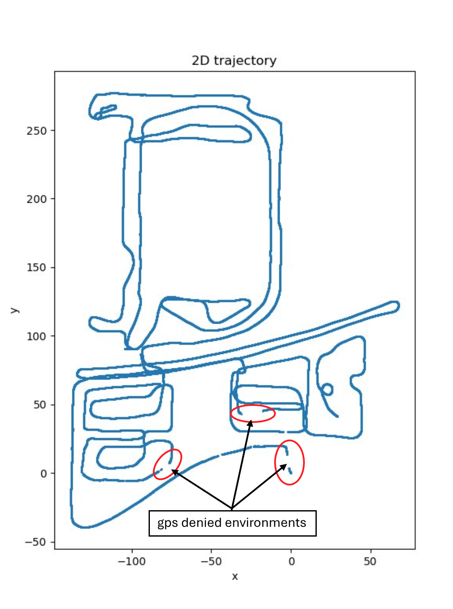
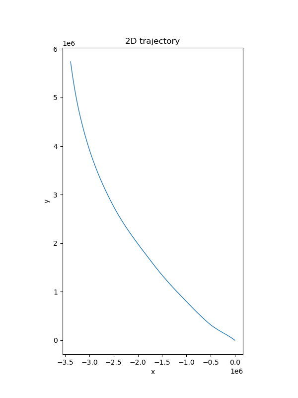
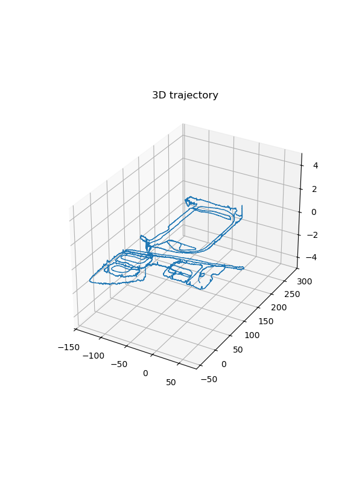
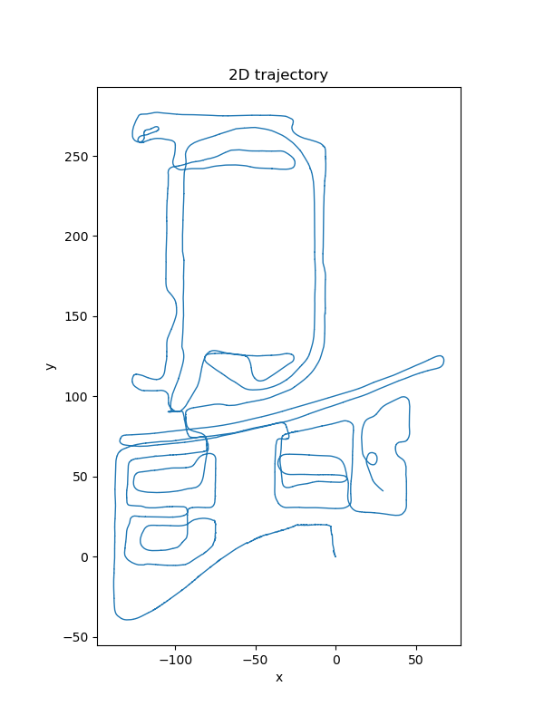
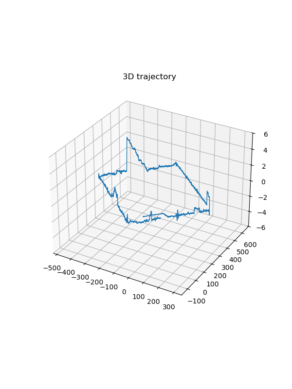
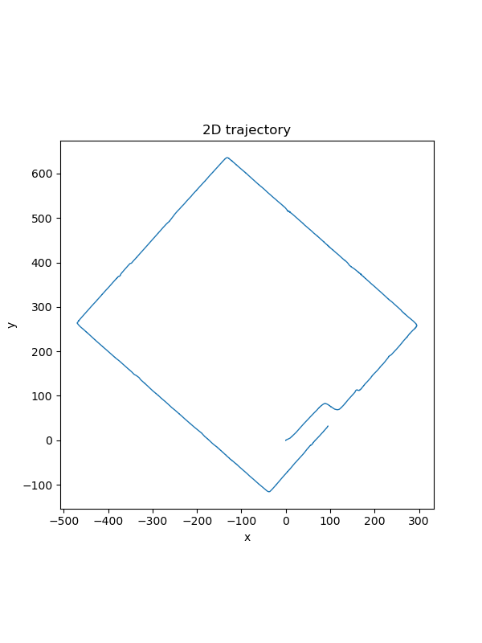
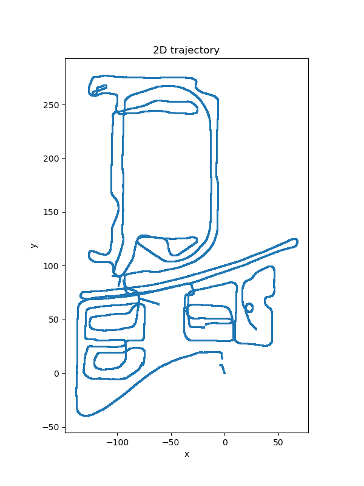
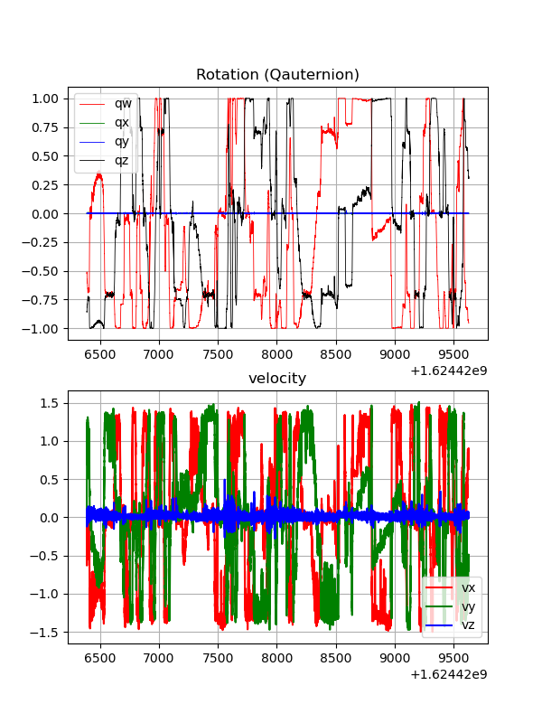

## GINS with IMU preintegration 

- Problem Statement:
    - Given IMU (accelerator, angular velocity), GNSS (lattitude, longtitude, heading, orientation), odom sensor data (left, right wheel impulse), 
    - estimate system state at each time step including position, orientation, velocity, accelerometer, gyroscope bias, gravity.
- Method: graph optimization (i.e., least square optimization problem): 
    - Objective: minimize the residual defined between two consecutive GNSS data (or keyframes so to speak), say time step i and time step j.
    - Vertices: (optimizable variables in the optimization objective function): state variables p, v, R, b_a, b_g at time step i and j;
    - Edges: (residuals or error between predicted and observed factors): imu preintegration, state prior at time step i, GNSS, odom, accelerometer and gyroscope bias time step i and j.
- Component:
    1. IMU data class
    2. GNSS data class
    3. Odom data class
    4. IMU preintegration class: 
        - preintegration measurements between two consecutive time steps.
        - imu bias (assuming unchanged during the time interval) at time step i
        - jacobian of bias that describes influence of change in bias estimate on imu measurements.
        - covariance of imu preintegration and measurements noise.
    5. IMU initialization class: esitmate imu measurements bias, coveriance of noise
    6. g2o vertex, edge class
- Optimization:
    - residuals:
       1. preintegration factors: $[\mathbf{r}^T_{\Delta R_{ij}}, \ \mathbf{r}^T_{\Delta v_{ij}}, \ \mathbf{r}^T_{\Delta p_{ij}}]^T$, jacobian see reference[1]
       2. prior factors: 

          $[\mathrm{Log}(R_{i,prior}^T R_i)^T, \ (p_i - p_{i, prior})^T, (v_i - v_{i, prior})^T, \ (b_{ai} - b_{ai, prior})^T, \ (b_{gi} - b_{gi, prior})^T ]^T$

          $\mathrm{Jacobian} = \mathrm{diag}(J_r^{-1}(R_{i,prior}^T R_i),  \mathbf{I}_3, \mathbf{I}_3,  \mathbf{I}_3,  \mathbf{I}_3)$

        4. Odom factor: $v_i - v_{i, odom}$;  jacobian: $\mathbf{I}_3$
        5. GNSS factor: 

            $[\mathrm{Log}(R_{i,gnss}^T R_i)^T, (p_i - p_{i, gnss})^T]^T$

            $\mathrm{Jacobian} = \mathrm{diag}(J^{-1}(R_{i,gnss}^T R_i), \ \mathbf{I}_3)$

        6. GNSS position only factor: $p_i - p_{i, gnss}$, jacobian = $\mathbf{I}_3$
        7. Gyroscope Bias factor: $b_{g, j} - b_{g, i}$,   jacobian = $[-\mathbf{I}_3, \mathbf{I}_3]$ 
        8. Accelerometer Bias factor: $b_{a, j} - b_{a, i}$,   jacobian = $[-\mathbf{I}_3, \mathbf{I}_3]$ 

- Testing
    - Rotation test: comparing gins system with imu integrator given constant angular velocity, the state estimation from imu preintegration should be same with regular imu integration.
    - Acceration test: given constant acceleration, the state estimation from imu preintegration should be same with regular imu integration.
    - error state kalman filter: starting from the same states the relative motion between two consecutive gnss data and the state estimation from IMU preintegration should be same with or close enough to the results from error state kalman filter.
- Results
    - As is mentioned in previous project [error state kalman filter](https://github.com/yangfan/eskf_imu), IMU sensor data can be used to estimate motion in a certain amount of time interval. It is especially helpful for the navigation in GPS-denied environment as shown in figure below:

        

    - However the state estimation from IMU data will diverge significantly due to accumulated error. 

        

    - To resolve the accumulated error of imu integration, it's natural to combine different source of sensor data, e.g., odometry, imu, gps. One method is error-state kalman filter which is able to predict the system state based on imu data and make the correction once the odom or gnss observation come. Due to the Markov assumption, the prediction and correction of Kalman filter are restricted to more recent time step and the new observation cannot be used to correct previous trajectory. Moreover in KF the nonlinear system is simplified as a linear system by the first-order tylor expansion, accuracy is influenced by the linearity of the approximation point. More detail about error state kalman filter can be found [here](https://github.com/yangfan/eskf_imu). 
    - Another method is the pose graph optimization which use the iterative method to solve the least square problem, i.e., Gauss–Newton algorithm and levenberg-marquardt method. This makes the system more robust to the nolinear world. Besides, pose graph method is able to optimze the whole trajectory based on all received data. Figures below show the results on two different dataset.

    - sensor data result

        

        
    
    - shape data result 

        

        
    
    - Besides involved in the pose graph optimization as the velocity factor, the odom data can also be used to correct the relative velocity of IMU preintegration, which is similar to the correction step of kalman filter. The odom correction improves the accuracy of the state estimate during the IMU preintegration when valid GNSS data is lost for a long period amount of time. The state variable in this case is defined as the relative velocity $\Delta v_{ij}$ of IMU preintegration while the observation is $v_{j,obs}$ which is obtained from odom data. The observation function is $\mathrm{h}(\Delta v_{ij}) = v_j = R_i \Delta v_{ij} + v_i + g \Delta t_{ij}$. The covariance matrix $P_{vel}$ can be obtained from the preintegrated measurement covariance. The covariance of odom sensor noise is denoted by $V$. The Jacobian is
    
      $$H = \frac{\partial \mathrm{h}}{\partial \delta \Delta v_{ij}} = R_i$$

      The correction step is following:
       
       1. Compute Kalman gain: $K = P_{vel} H^T (H P_{vel} H^T + V)^{-1}$
       2. Compute update: $\delta \Delta v_{ij} = K (v_{j,obs} - \mathrm{h}(\Delta v_{ij}))$
       3. Update preintegrated relative velocity $\Delta v_{ij} \leftarrow \Delta v_{ij} + \delta \Delta v_{ij}$
    
    - Here are the results:

      - No odom correction and only use gnss data with valid heading for optimization. There exists a few gaps and deviations in the trajectory, and spikes are also found in velocity curve:
            
        

        
    
      - Use odom correction and only use gnss data with valid heading for optimization. The velocity remains stable due to the odom correction. The gaps are not found in the figure below: 

        

        

      - Note that unlike the typical correction step in Kalman filter, the covariance matrix $P_{vel}$ is not updated to the preintegrator. Because the update will break the symmetric and positive-definite properties of preintegration covariance matrix. Therefore the Cholesky decomposition for solving linear equation in optimization interation will fail.
    
### Dependencies
- [Eigen](https://gitlab.com/libeigen/eigen)
- [Sophus](https://github.com/strasdat/Sophus)
- [Gflags](https://github.com/gflags/gflags)
- [Glog](https://github.com/google/glog)
- [G2o](https://github.com/RainerKuemmerle/g2o)

### References
1. [On-Manifold Preintegration for Real-Time Visual-Inertial Odometry](https://arxiv.org/abs/1512.02363)

2. [slam in autonomous driving](https://github.com/gaoxiang12/slam_in_autonomous_driving)

3. [imu eskf ](https://github.com/yangfan/eskf_imu)
